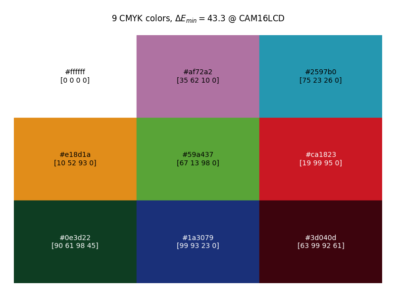
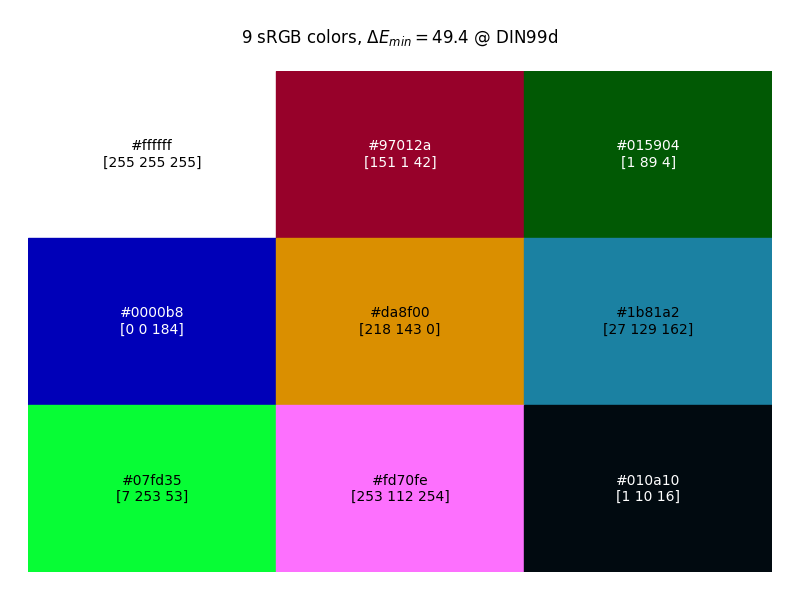

# Max Distance Colors

[English](README_en.md)

-----------
## 1. 功能
在科学绘图和数据可视化中，需要让不同颜色之间的视觉差异足够大，为此开发了此程序来生成最佳的颜色色板。主要功能是根据给定数量生成颜色列表，确保颜色之间差异最大化。

已经计算好的，2-50之间每个数量的最大化色差的颜色列表，直接点此下载：[Colors.xlsm](results/Colors.xlsm)

-----------
## 2. 基本原理
为了真实反应色彩的视觉差异，需要用更准确的[颜色差异](https://en.wikipedia.org/wiki/Color_difference)（ΔE）衡量标准，而不是直接在RGB空间中最大化色彩间的欧几里得距离。已有的ΔE标准有CIE76, CIE94, CIEDE2000等，算法复杂度各有不同。相对于遍历所有颜色然后判断其与与已有颜色之间的ΔE，更简单的方法是在一个[均匀色彩空间](https://en.wikipedia.org/wiki/Color_appearance_model)（UCS）中让**颜色之间的距离尽量均匀且最大化**。目前（2025年）在感知均匀度方面比较优秀的均匀色彩空间有CAM16UCS, DIN99d, OKLab等。

本程序的基本原理是：确定sRGB（或其他色域）在UCS中的轮廓边界，在边界内随机生成N个点，给这些点之间施加斥力，模拟点在3D空间中的运动，直到到达边界。一段时间之后点分布基本到达稳定。为了防止点到达边界时被定住，对到达边界的点施加了随机扰动使其有脱离边界的趋势。

经过对比，这是我能找到的色彩分布距离最大的实现方式。尽管由于初始点的选取随机性，有时会陷入局部最优而不是全局最优。

另外由于计算精度和计算时间的限制，找到的结果并不是理论上的最优解，但与理论的最大ΔE之间的差距通常小于0.5。也是由于这个原因，最终输出的颜色序列并不是唯一的；尤其是对于较大的N，结果有更大的多样性。

-----------
## 3. 示例
### 3.1. 简单使用
#### 3.1.1. 安装依赖
```commandline
pip install -r requirements.txt
```

#### 3.1.2. 单次运行
单次运行有可能陷入局部最优，但通常色彩之间的差距也足够大，可以满足一般用途。在python中使用以下代码生成`9`个颜色（含白色）：
```python
from mdcolors import single_run

single_run(9)
```
等待几秒至一分钟，生成如下绘图，显示了最终生成的9个色彩在CAM16UCS色彩空间中的分布，以及优化过程中，最相近一对色彩之间ΔE的变化情况：


以下为生成的色彩的可视化以及他们的Hex表示以及RGB表示：


### 3.2. 进阶使用
#### 3.2.1. 限制颜色到CMYK空间中，针对印刷制品上的视觉差异选取颜色
```python
from mdcolors import single_run

single_run(9, color_space='CMYK')
```


>注：由于CMYK与RGB之间的转化不是唯一对应的，RGB转换回CMYK之后的色彩会有一定差异，因此生成的颜色之间的色差均匀性会差于RGB色彩。使用凹包而不是凸包来对边界建模，可能对均匀性有一定提升，但程序速度会慢5倍以上，通常没有这个必要。如有需要，在run之前加入一行：`CMYK_PARAMS['hull_type'] = 'concave'`

#### 3.2.2. 使用其他的均匀色彩空间，比如DIN99d，Oklab等
```python
from mdcolors import single_run

single_run(9, metric_space='DIN99d')
```

[//]: # (![color_patch_sRGB_in_DIN99d.png]&#40;example/color_patch_sRGB_in_DIN99d.png&#41;)
<p align="center">

</p>

#### 3.2.3. 用更多的运算时间，换来更加接近全局最优的色彩列表
##### 3.2.3.1. 提高模拟精度
```python
from mdcolors import single_run

single_run(9, quality='medium') # 默认quality='fast', 可选'medium', 'slow'
```

##### 3.2.3.2. 运行多次模拟，输出ΔE最大的一次运算结果
```python
from mdcolors import multi_run

if __name__ == '__main__':
    multi_run(9, num_runs=20)
```
##### 3.2.3.3. 或者将两者结合起来：
```python
from mdcolors import multi_run

if __name__ == '__main__':
    multi_run(9, num_runs=20, quality='medium')
```

#### 3.2.4. 手动指定固定颜色
**注意：** 给定颜色时，数值必须在0-1之间。
```python
from mdcolors import single_run

single_run(9, given_colors=[[1, 1, 1], [0, 0, 0]])
```

#### 3.2.5. 批量运行并输出列表
```python
import csv
import numpy as np

from mdcolors import multi_run

if __name__ == '__main__':
    result = [[0, 0, [None]]]
    for n in np.arange(2, 33, 1):
        csv_file = "sRGB_x_Japan2001Coated_CAM16.csv"
        hexs, de = multi_run(n, [1, 1, 1], color_space='CMYK', quality='medium', num_runs=32, show=False)
        result.append([n, de, hexs])

        with open(csv_file, "w", newline='') as f:
            writer = csv.writer(f)
            writer.writerow(["Number of Colors", "Delta E", "Colors"])
            for row in result:
                new_row = [row[0], row[1], *row[2]]
                writer.writerow(new_row)
```
使用[result/Colors.xlsm](result/Colors.xlsm)文件可以得到如下所示的结果：


------------
## TODO:
1. 色盲友好颜色模式
