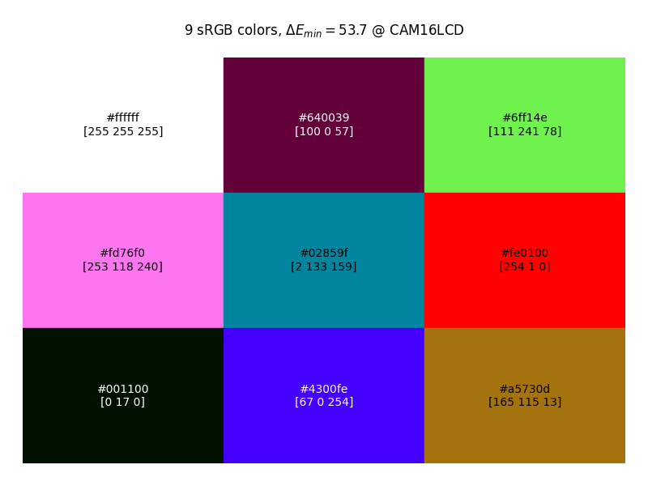
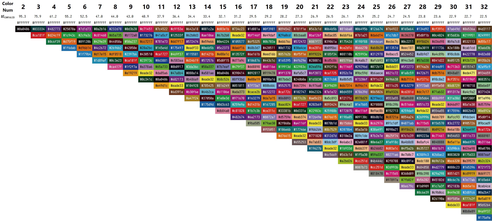

# Max Distance Colors

[中文](README.md)

-----------
## 1. Functionality
In scientific plotting and data visualization, it is necessary to ensure that the visual differences between different colors are sufficiently large. To achieve this, this program was developed to generate an optimal color palette. The main function is to generate a list of colors based on a given number, ensuring that the differences between colors are maximized.

Precomputed color lists with maximized color differences for each quantity between 2 and 50 can be downloaded directly by clicking here: [Colors.xlsm](results/Colors.xlsm)

-----------
## 2. Basic Principles
To accurately reflect the visual differences in colors, a more precise [color difference](https://en.wikipedia.org/wiki/Color_difference) (ΔE) metric is needed, rather than simply maximizing the Euclidean distance in the RGB space. Existing ΔE standards include CIE76, CIE94, CIEDE2000, etc., with varying levels of algorithmic complexity. Instead of traversing all colors and then judging their ΔE with existing colors, a simpler method is to **make the distances between colors as uniform and maximized as possible** in a [uniform color space](https://en.wikipedia.org/wiki/Color_appearance_model) (UCS). Currently (2025), uniform color spaces with excellent perceptual uniformity include CAM16UCS, DIN99d, OKLab, etc.

The basic principle of this program is: determine the boundary of sRGB (or other color gamuts) in the UCS, randomly generate N points within the boundary, apply repulsive forces between these points, simulate the motion of points in 3D space until they reach the boundary. After some time, the point distribution will stabilize. To prevent points from being fixed when they reach the boundary, random perturbations are applied to points that reach the boundary to give them a tendency to move away from the boundary.

After comparison, this is the implementation method I found that maximizes the distance between colors. Although due to the randomness of the initial point selection, it sometimes falls into a local optimum rather than a global optimum.

Additionally, due to limitations in computational precision and time, the results found are not the theoretical optimal solution, but the gap with the theoretical maximum ΔE is usually less than 0.5. For this reason, the final output color sequence is not unique; especially for larger N, the results have greater diversity.

-----------
## 3. Examples
### 3.1. Simple Usage
#### 3.1.1. Install Dependencies
```commandline
pip install -r requirements.txt
```

#### 3.1.2. Single Run
A single run may fall into a local optimum, but usually the differences between colors are large enough to meet general needs. Use the following code in Python to generate `9` colors (including white):
```python
from mdcolors import single_run

single_run(9)
```
Wait for a few seconds to a minute, and the following plot will be generated, showing the distribution of the final 9 colors in the CAM16UCS color space, as well as the change in ΔE between the closest pair of colors during the optimization process:


Below is a visualization of the generated colors and their Hex and RGB representations:
<p align="center">

</p>

### 3.2. Advanced Usage
#### 3.2.1. Restrict Colors to the CMYK Space, Select Colors for Visual Differences in Printed Materials
```python
from mdcolors import single_run

single_run(9, color_space='CMYK')
```
<p align="center">

</p>

>Note: Since the conversion between CMYK and RGB is not uniquely corresponding, the colors converted back to CMYK will have some differences, so the color difference uniformity of the generated colors will be worse than RGB colors. Using a concave hull instead of a convex hull to model the boundary may improve uniformity, but the program speed will be more than 5 times slower, which is usually not necessary. If needed, add a line before running: `CMYK_PARAMS['hull_type'] = 'concave'`

#### 3.2.2. Use Other Uniform Color Spaces, Such as DIN99d, Oklab, etc.
```python
from mdcolors import single_run

single_run(9, metric_space='DIN99d')
```
<p align="center">


</p>

#### 3.2.3. Use More Computation Time to Get a Color List Closer to the Global Optimum
##### 3.2.3.1. Increase Simulation Accuracy
```python
from mdcolors import single_run

single_run(9, quality='medium') # Default quality='fast', options 'medium', 'slow'
```

##### 3.2.3.2. Run Multiple Simulations, Output the Result with the Largest ΔE
```python
from mdcolors import multi_run

if __name__ == '__main__':
    multi_run(9, num_runs=20)
```
##### 3.2.3.3. Or Combine Both:
```python
from mdcolors import multi_run

if __name__ == '__main__':
    multi_run(9, num_runs=20, quality='medium')
```

#### 3.2.4. Manually Specify Fixed Colors
**Note:** When specifying colors, the values must be between 0 and 1.
```python
from mdcolors import single_run

single_run(9, given_colors=[[1, 1, 1], [0, 0, 0]])
```

#### 3.2.5. Batch Run and Output List
```python
import csv
import numpy as np

from mdcolors import multi_run

if __name__ == '__main__':
    result = [[0, 0, [None]]]
    for n in np.arange(2, 33, 1):
        csv_file = "sRGB_x_Japan2001Coated_CAM16.csv"
        hexs, de = multi_run(n, [1, 1, 1], color_space='CMYK', quality='medium', num_runs=32, show=False)
        result.append([n, de, hexs])

        with open(csv_file, "w", newline='') as f:
            writer = csv.writer(f)
            writer.writerow(["Number of Colors", "Delta E", "Colors"])
            for row in result:
                new_row = [row[0], row[1], *row[2]]
                writer.writerow(new_row)
```
Using the [result/Colors.xlsm](result/Colors.xlsm) file, you can get the following result:


------------
## 4. See Also
1. [bdamokos/pick-distinct-colors](https://github.com/bdamokos/pick-distinct-colors)
2. [medialab/iwanthue](https://github.com/medialab/iwanthue)
3. Tim Holy's [Generate maximally perceptually-distinct colors](http://www.mathworks.se/matlabcentral/fileexchange/29702-generate-maximally-perceptually-distinct-colors) for MATLAB

------------
## TODO:
1. Colorblind-friendly color mode
